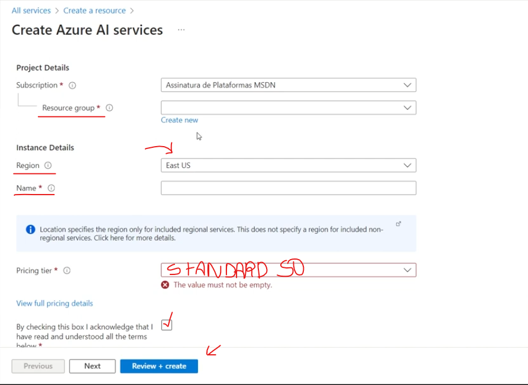

# Primeiros passos

- Crie um **`novo recurso`**
- Em **Categorias** no menu esquerdo, selecione **`AI + Machine Learning`**
- Busque pelo modelo de **`Azure AI services`** e o inicie
- Preenha os campos conforme os exemplos abaixo:

## Vision Cogniteve

Entre o site [Vision Cogniteve](https://portal.vision.cognitive.azure.com/) da Azure

Faça o login com **sua conta Microsoft Azure** e siga os seguintes passos:

- Clique em **`view all resources`**
- Selecione o seu modelo criado na Azure como **`padrão`**

> Logo abaixo você terá acesso aos serviços de Detecção visual

# Conceito

Os serviços de visão computacional do Azure oferecem acesso a tecnologias avançadas de aprendizado de máquina, facilitando a implementação de recursos de análise de imagem em aplicativos existentes. Esses serviços permitem lidar com grandes volumes de dados e demanda de processamento, além disso, o amplo suporte técnico e a documentação detalhada tornam o **desenvolvimento e a resolução de problemas mais acessíveis para os usuários.**

# Insights e Possibilidades

### Acessibilidade: 

> As tecnologias de visão computacional podem ajudar a melhorar a acessibilidade para pessoas com deficiências visuais. Por exemplo, sistemas de reconhecimento de objetos podem identificar e descrever visualmente o ambiente ao redor de pessoas com deficiência visual, permitindo-lhes navegar com mais facilidade em espaços públicos.

### Segurança Pública: 

> A análise de vídeo em tempo real pode ser usada para detectar atividades suspeitas em áreas urbanas e melhorar a segurança pública. Isso pode incluir a detecção de comportamentos violentos, movimentos de multidões ou objetos deixados para trás em locais públicos.

### Educação: 

> Tecnologias de visão computacional podem melhorar a educação de várias maneiras, desde a personalização da aprendizagem até a detecção de comportamentos de sala de aula. Por exemplo, sistemas de análise de vídeo podem ajudar os educadores a identificar padrões de comportamento dos alunos e fornecer feedback individualizado para melhorar o engajamento e o desempenho acadêmico.

### Agricultura: 

> A análise de imagens de satélite pode ser usada para monitorar o crescimento das plantações e identificar problemas de saúde das culturas. Isso pode ajudar os agricultores a tomar decisões informadas sobre irrigação, fertilização e tratamento de pragas.

### Saúde: 

> A visão computacional pode desempenhar um papel crucial na medicina, auxiliando em diagnósticos médicos mais precisos. Por exemplo, algoritmos de análise de imagem podem ajudar a identificar padrões em imagens de exames de imagem médica, como tomografias computadorizadas e ressonâncias magnéticas, para detectar doenças precocemente.

- [**Inteligência Artificial (IA) pode tornar tratamentos contra câncer de mama mais eficientes**](https://www.cnnbrasil.com.br/saude/ia-pode-poupar-paciente-com-cancer-de-mama-de-tratamento-inutil-diz-estudo/#:~:text=Uma%20nova%20ferramenta%20de%20Intelig%C3%AAncia,Medicina%20Feinberg%20da%20Northwestern%20University.)

### Preservação Ambiental: 

> A visão computacional pode ser usada para monitorar e proteger o meio ambiente. Por exemplo, detectar desmatamento ilegal e monitorar a biodiversidade em ecossistemas sensíveis.

- [**Inteligência artificial e sustentabilidade**](https://www.ecycle.com.br/inteligencia-artificial/)
